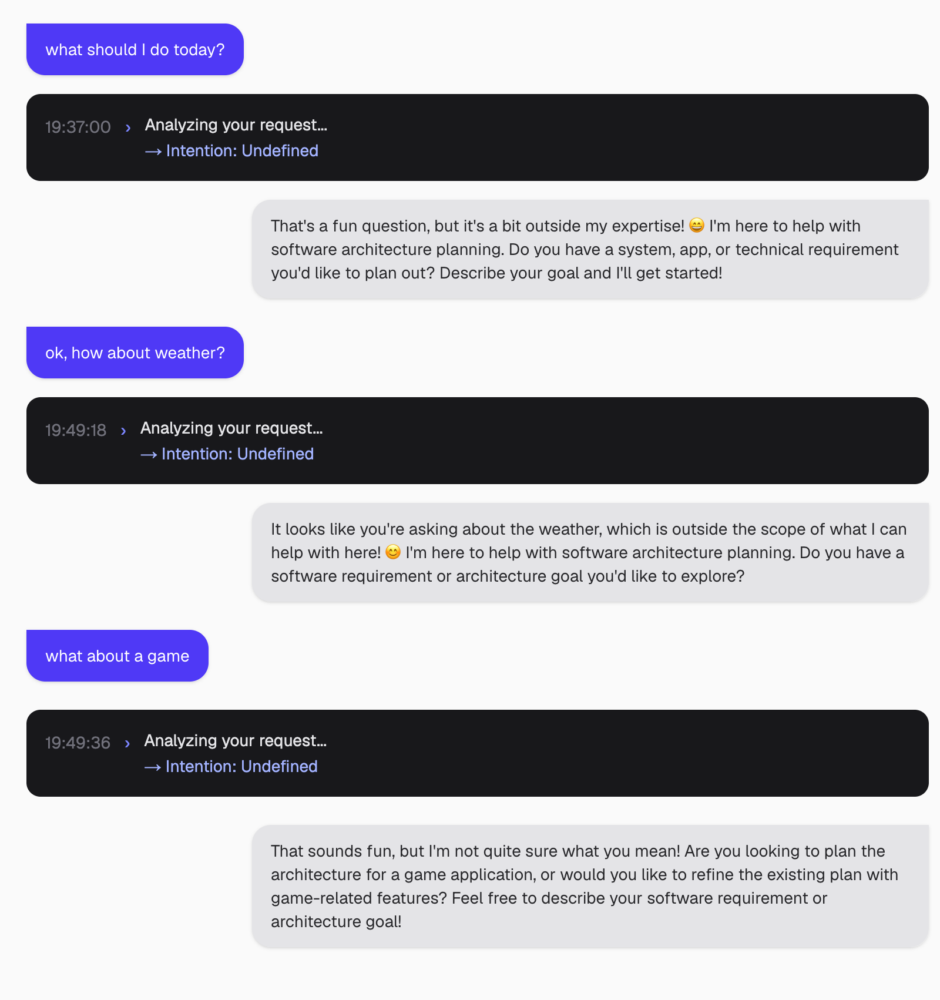
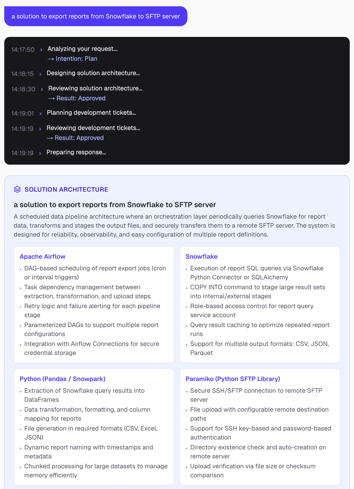
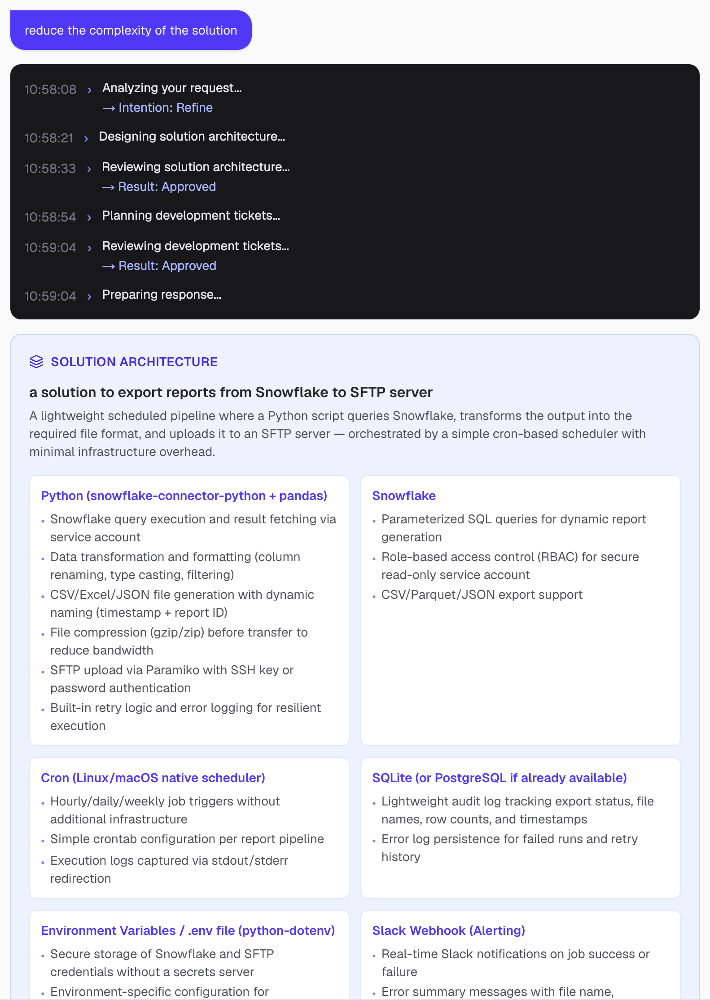
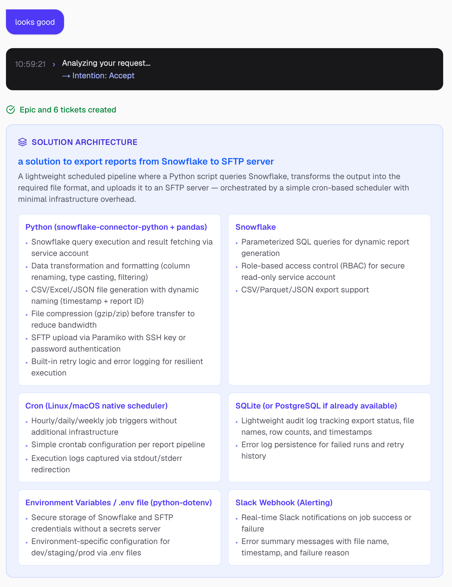
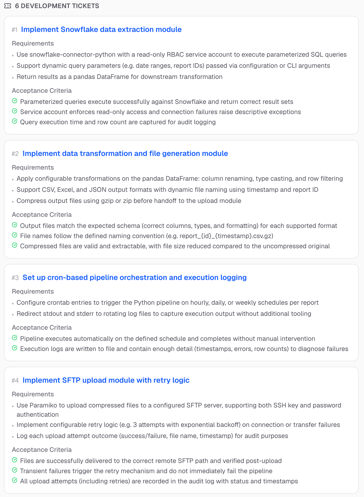
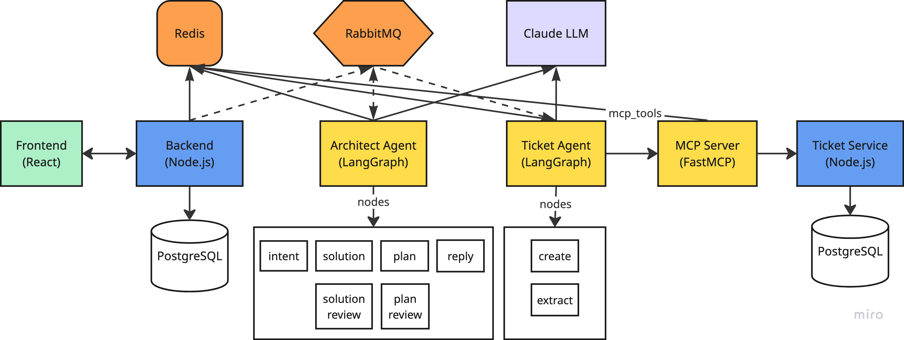
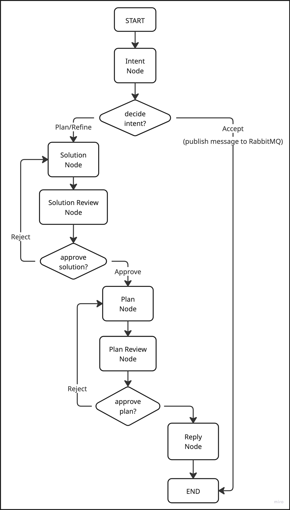
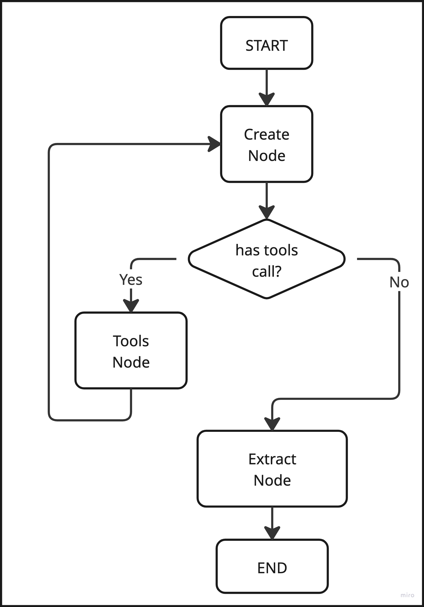

# Approval-Loop Architecture: Building Reliable Multi-Agent Systems with LangGraph

This article walks through the design and implementation of a **multi-agent AI** system for software architecture planning. A user types a requirement — "implement an SFTP export solution" — and a pipeline of specialised AI agents collaborates to deliver a solution: the **architect-agent** produces a solution architecture and development tickets through a directed approval-loop graph, and the **ticket-agent** — a separate two-node `StateGraph` — receives the accepted plan over RabbitMQ and persists it via LLM-driven tool calling followed by structured output extraction. Two embedded reviewer agents run approval loops, each sending feedback back to the generator if the output is not good enough. Once both loops pass, the user sees the final plan. They can refine it with a follow-up, or accept it to trigger the ticket-agent.

The focus is on the decisions that make this work in practice:
- How to design a directed graph with conditional approval loops
- How to structure node classes with injected dependencies and structured output contracts
- How to carry conversation context across turns for the refine flow
- How to hand off between two independent services using RabbitMQ
- How to build a two-node ticket agent with a tool-calling loop and a structured extraction step
- How to authenticate service-to-service calls with OAuth 2.0 Client Credentials via Keycloak
- How to add user login with OpenID Connect (OIDC) Authorization Code Flow and PKCE
- How to stream per-node progress to the browser in real time











---

## Architecture Overview



**Frontend** (Next.js 16, port 3000) — requirement input, live thinking log, plan card, and final reply. Opens a WebSocket and receives real-time `chat-update` events as each agent node runs. Accepted plans link to `/epic/:id` and `/ticket/:id` detail pages served by dedicated Next.js routes. Uses `keycloak-js` for user authentication (OIDC Authorization Code Flow + PKCE) — unauthenticated users are redirected to Keycloak login automatically. The logged-in user's name and email are shown in the sidebar, and conversation history is scoped to that user.

**Backend** (NestJS 11, port 8000) — REST chat API and ticket proxy. Creates conversations in PostgreSQL (stores `username` from the authenticated user), manages live state in Redis, publishes `ChatEvent` to RabbitMQ, and drives the WebSocket gateway. Also proxies `/api/epic/*` and `/api/ticket/*` to the ticket-service — each proxy request includes a Keycloak access token obtained via the `backend` client credentials.

**Keycloak** (port 8080, realm `architect`) — central Authorization Server for all authentication. Manages two types of clients: confidential M2M clients (`ticket-agent`, `mcp-server`, `backend`) that use the OAuth 2.0 Client Credentials flow to obtain access tokens for service-to-service calls, and the public `frontend` OIDC client that uses Authorization Code + PKCE for browser user login. Issues RS256-signed JWTs; services validate tokens by fetching Keycloak's JWKS endpoint. The entire realm configuration is in `infra/keycloak/realm.json` and auto-imported on startup.

**RabbitMQ** — two durable queues: `architecture-agent.chat` (backend → architect-agent) and `architecture-agent.accept` (architect-agent → ticket-agent). Both publishers return immediately; consumers process independently.

**Architect Agent** (FastAPI + LangGraph, port 8001) — subscribes to `architecture-agent.chat`, runs the directed approval-loop graph, and writes progress to Redis after every node. On accept intent, publishes an `AcceptEvent` to `architecture-agent.accept` instead of creating tickets itself.

**Ticket Agent** (FastAPI + LangGraph, port 8004) — subscribes to `architecture-agent.accept` and runs a two-node `StateGraph`. On startup, reads the `mcp_tools` key from Redis and dynamically builds `StructuredTool` instances via `McpToolBuilder`. `create_node` drives a tool-calling loop (`create_epic` → `create_ticket` × N), then `extract_node` reads the tool results and writes `ExtractOut { epicId, ticketIds }` to state. `TicketService` converts this into `FinalReplyInterface`, writes it to Redis, and sets `agentStatus = hasReplied`. Before each MCP call, `KeycloakTokenService` obtains a Keycloak access token using the `ticket-agent` client credentials.

**MCP Server** (FastMCP + FastAPI, port 8002) — exposes `create_epic` and `create_ticket` over the MCP protocol. On startup, serialises the tools spec (name, description, inputSchema, providerHost) into Redis under `mcp_tools` so consumers can discover tools without hardcoding them. Inbound MCP requests are authenticated by a JWT middleware that validates the Keycloak-issued token against Keycloak's JWKS endpoint. Outbound REST calls to ticket-service include a Keycloak token obtained via the `mcp-server` client credentials.

**Ticket Service** (NestJS 11, port 8003) — minimal CRUD service backed by its own PostgreSQL instance. No RabbitMQ, no Redis, no WebSocket. All endpoints (except `/api/health`) are protected by a global `JwtGuard` that validates Keycloak-issued RS256 tokens against Keycloak's JWKS endpoint.

---

## Step 1 — Design a Multi-Agent Approval Loop Graph

A ReAct agent (like the tourguide-agent) uses a single LLM instance deciding which tools to call in an open-ended loop. This project uses a different pattern: a **directed graph of specialised agents**, each with a narrow role, connected by explicit conditional edges.



The graph has two approval loops:

```
intent_node
  │
  ├─[plan / refine]──► solution_node ◄──────────────┐
  │                         │                       │
  │                  solution_review_node            │
  │                    │           │                 │
  │                [approved]  [rejected] ───────────┘
  │                    │
  │               plan_node ◄──────────────────────┐
  │                    │                           │
  │             plan_review_node                   │
  │                │         │                     │
  │            [approved] [rejected] ──────────────┘
  │                │
  │           reply_node ──► END
  │
  └─[accept]──► publish AcceptEvent to architecture-agent.accept ──► END
```

The accept path no longer creates tickets inside the graph. `IntentNode` publishes the full plan to RabbitMQ and returns immediately, leaving `agentStatus = isThinking` in Redis. The ticket-agent picks up the event asynchronously and finalises the conversation.

Each approval loop feeds the reviewer's comments back into the generator node as context for the next iteration. The generator never sees an empty critique — if it is rejected, it knows exactly what to fix.

Building the graph in LangGraph is explicit and readable:

```python
class ArchitectGraph:
    def __init__(self, llm: ChatAnthropic, publisher: RabbitMQPublisher):
        self._llm = llm
        self._publisher = publisher

    def build(self):
        graph = StateGraph(ArchitectState)

        graph.add_node("intent_node",          IntentNode(self._llm, self._publisher))
        graph.add_node("solution_node",         SolutionNode(self._llm))
        graph.add_node("solution_review_node",  SolutionReviewNode(self._llm))
        graph.add_node("plan_node",             PlanNode(self._llm))
        graph.add_node("plan_review_node",      PlanReviewNode(self._llm))
        graph.add_node("reply_node",            ReplyNode())

        graph.add_conditional_edges("intent_node", self._route_intent,
            {"accept": END, "plan": "solution_node", "refine": "solution_node"})

        graph.add_edge("solution_node", "solution_review_node")
        graph.add_conditional_edges("solution_review_node", self._route_solution_review,
            {"approved": "plan_node", "rejected": "solution_node"})

        graph.add_edge("plan_node", "plan_review_node")
        graph.add_conditional_edges("plan_review_node", self._route_plan_review,
            {"approved": "reply_node", "rejected": "plan_node"})

        graph.add_edge("reply_node", END)
        return graph.compile()
```

`IntentNode` now receives the `RabbitMQPublisher` as a constructor dependency. On `accept` intent it publishes to the queue and returns `{"user_intent": "accept"}` — the graph routes to `END` immediately. On `refine`, it extracts the prior solution for context as before.

The routing functions read directly from state — no complex logic, just field checks:

```python
@staticmethod
def _route_solution_review(state: ArchitectState) -> str:
    return "approved" if state.get("solution_approved") else "rejected"
```

---

## Step 2 — Type the State Contract

LangGraph's `MessagesState` provides the `messages` list (LangChain message history). `ArchitectState` extends it with domain fields that flow through the graph:

```python
class ArchitectState(MessagesState):
    requirement: str
    raw_history: list[dict]
    user_intent: str               # "plan" | "accept" | "refine"
    prior_solution: dict | None    # solution from the previous turn (refine context)
    solution: dict | None
    solution_review_comments: list[str]
    solution_approved: bool
    tickets: list[dict]
    ticket_review_comments: list[str]
    tickets_approved: bool
    final_reply: dict | None
```

Each node returns a partial dict — only the fields it touches. LangGraph merges the update into the existing state. A node that does not touch `tickets` leaves `tickets` unchanged. This makes each node's contract explicit: `SolutionReviewNode` only writes `solution_approved` and `solution_review_comments`; it never touches `tickets`.

`raw_history` is distinct from `messages`. `messages` is the LangChain message list for the current turn. `raw_history` is the full serialised `MessageInterface[]` from previous turns in the conversation — needed for intent classification and for recovering the prior plan when the user says "reduce the complexity".

---

## Step 3 — Node Classes with Injected Dependencies

Each node is a Python class. The constructor receives its dependencies; `__call__` executes the node logic. LangGraph accepts any callable — an instance with `__call__` satisfies that contract without any special registration.

Each node's concerns are cleanly separated across three directories:

- **`agent/schemas/`** — Pydantic output models (`SolutionOut`, `PlanOut`, etc.), one file per node
- **`agent/personas/`** — system prompts that define the LLM's role and behaviour, one file per node
- **`agent/templates/`** — parameterised user prompt strings (`SOLUTION_USER_NEW`, `SOLUTION_USER_REFINE`, etc.), one file per node

A node imports exactly what it needs and contains only logic:

```python
from app.agent.schemas.solution_schema import SolutionOut
from app.agent.personas.solution_persona import SOLUTION_PERSONA
from app.agent.templates.solution_templates import SOLUTION_USER_NEW, SOLUTION_USER_REFINE, SOLUTION_USER_REVISE

class SolutionNode:
    def __init__(self, llm: ChatAnthropic):
        self._llm = llm.with_structured_output(SolutionOut)

    async def __call__(self, state: ArchitectState) -> dict:
        ...
        prompt = self._build_prompt(state, requirement, comments, prior_solution)
        result: SolutionOut = await self._llm.ainvoke([SystemMessage(content=SOLUTION_PERSONA), HumanMessage(content=prompt)])
        return {"solution": result.model_dump(), "solution_approved": False}
```

`with_structured_output(SolutionOut)` is bound once in `__init__`, not on every invocation. The LLM instance is shared across all nodes — a single `ChatAnthropic` object is created in the container and injected wherever it is needed:

```python
class Container:
    @cached_property
    def llm(self) -> ChatAnthropic:
        return ChatAnthropic(model="claude-sonnet-4-6", api_key=settings.anthropic_api_key, max_tokens=4096)

    @cached_property
    def rabbitmq_publisher(self) -> RabbitMQPublisher:
        return RabbitMQPublisher(settings.rabbitmq_url)

    @cached_property
    def agent_graph(self):
        return ArchitectGraph(self.llm, self.rabbitmq_publisher).build()
```

---

## Step 4 — Structured Output Schemas

Every node that calls an LLM uses `with_structured_output()` with a Pydantic model. The model is the contract: the LLM is forced to return valid JSON matching the schema, and the code never parses free-form text. Each schema lives in its own file under `agent/schemas/`:

```python
# agent/schemas/solution_schema.py
class SolutionOut(BaseModel):
    architecture: str
    components: list[ComponentOut]

# agent/schemas/solution_review_schema.py
class SolutionReviewOut(BaseModel):
    approved: bool
    comments: list[str] = []

# agent/schemas/plan_schema.py
class PlanOut(BaseModel):
    tickets: list[TicketOut]

# agent/schemas/plan_review_schema.py
class PlanReviewOut(BaseModel):
    approved: bool
    comments: list[str] = []
```

The reviewer models have `comments: list[str] = []` as an optional field with a default. This is important: when the LLM approves, it may omit `comments` entirely — a required field would raise a `ValidationError`. Making it optional with a default means approval responses always parse cleanly.

The `approved` field drives the conditional edge directly. No string matching, no post-processing — the Pydantic model is both the output parser and the routing signal:

```python
return {
    "solution_approved": result.approved,
    "solution_review_comments": result.comments if not result.approved else [],
}
```

---

## Step 5 — Three-Path Intent Routing

The first node in every graph run is `IntentNode`. It classifies the user's message into one of three intents:

```python
# agent/schemas/intent_schema.py
class IntentOut(BaseModel):
    intent: Literal["accept", "refine", "plan"]
```

The persona draws a clear line between the three:

```
- "accept": user is satisfied and wants to proceed ("looks good", "yes", "create it")
- "refine": user wants to change the existing plan ("reduce complexity", "add a security ticket")
- "plan": first message or new unrelated requirement
```

When the intent is `refine`, the node extracts the prior solution from `raw_history` for context. When the intent is `accept`, it publishes an `AcceptEvent` to RabbitMQ and returns — no state is carried forward because ticket creation happens in a separate service. The two paths are handled in separate methods:

```python
async def __call__(self, state: ArchitectState) -> dict:
    ...
    result: IntentOut = await self._llm.ainvoke([...])
    if result.intent == "accept":
        return await self._handle_accept(state)
    return self._build_updates(state, result)

async def _handle_accept(self, state: ArchitectState) -> dict:
    conversation_id = state.get("conversation_id", "")
    for msg in reversed(state.get("raw_history", [])):
        content = msg.get("content", {})
        if isinstance(content, dict) and "epic" in content and "tickets" in content:
            await self._publisher.publish("architecture-agent.accept", {
                "conversationId": conversation_id,
                "content": content,
            })
            break
    return {"user_intent": "accept"}

def _build_updates(self, state: ArchitectState, result: IntentOut) -> dict:
    updates: dict = {"user_intent": result.intent}
    if result.intent == "refine":
        for msg in reversed(state.get("raw_history", [])):
            content = msg.get("content", {})
            if isinstance(content, dict) and "epic" in content and "tickets" in content:
                updates["prior_solution"] = content["epic"].get("solution")
                break
    return updates
```

On `accept`, `chat_service` detects `user_intent == "accept"` and skips its own `append_reply_message` call, leaving `agentStatus = isThinking` in Redis. The ticket-agent finalises the conversation. On `refine`, the extracted `prior_solution` travels into `SolutionNode` as context for the revision.

---

## Step 6 — Approval Loops with Reviewer Context

The two approval loops are the core of the quality-control mechanism. `SolutionNode` handles three distinct scenarios based on state. The prompt-selection logic is extracted into a private `_build_prompt` method; `__call__` stays focused on invoking the LLM and returning state updates:

```python
async def __call__(self, state: ArchitectState) -> dict:
    requirement = state.get("requirement", "")
    comments = state.get("solution_review_comments", [])
    prior_solution = state.get("prior_solution")

    prompt = self._build_prompt(state, requirement, comments, prior_solution)
    result: SolutionOut = await self._llm.ainvoke([SystemMessage(content=SOLUTION_PERSONA), HumanMessage(content=prompt)])
    return {"solution": result.model_dump(), "solution_approved": False}

def _build_prompt(self, state, requirement, comments, prior_solution) -> str:
    if comments:
        return SOLUTION_USER_REVISE.format(
            requirement=requirement,
            current_solution=json.dumps(state.get("solution", {}), indent=2),
            comments="\n".join(f"- {c}" for c in comments),
        )
    if prior_solution:
        return SOLUTION_USER_REFINE.format(
            requirement=requirement,
            prior_solution=json.dumps(prior_solution, indent=2),
        )
    return SOLUTION_USER_NEW.format(requirement=requirement)
```

The three template strings (`SOLUTION_USER_NEW`, `SOLUTION_USER_REFINE`, `SOLUTION_USER_REVISE`) live in `agent/templates/solution_templates.py`, separate from the node.

The reviewer's comments are never discarded — they travel in state from `solution_review_node` back into `solution_node` on the next iteration. The generator sees exactly what was wrong and why. The same pattern applies to `PlanNode` and `PlanReviewNode`.

The reviewer system prompts are calibrated to avoid infinite loops:

```
Reject (approved=false) only if there are significant gaps or mismatches.
Approve most reasonable solutions after one revision.
```

Without this, a strict reviewer and an imperfect generator can loop indefinitely. The instruction sets a practical upper bound: one revision is usually sufficient.

---

## Step 7 — Ticket Agent: A Two-Node StateGraph

The ticket-agent is an independent service with its own LLM, RabbitMQ consumer, and `StateGraph`. Unlike `create_react_agent` — which uses an open-ended loop with no structured output step — this graph separates concerns into two explicit nodes: one that calls tools and one that extracts a typed result.



### Graph structure

```
START → create_node ◄──────────┐
            │                  │
  ┌─[tool calls]──► tools ─────┘
  │
  └─[done]──► extract_node → END
```

`create_node` drives the tool-calling loop. `tools` is a `ToolNode` that executes the calls. `extract_node` uses `with_structured_output(ExtractOut)` to read the tool results from the message history and return a typed `ExtractOut`.

The graph and state are:

```python
class TicketState(MessagesState):
    extract_out: ExtractOut | None = None

class TicketGraph:
    def __init__(self, llm: ChatAnthropic, tools: list[StructuredTool]):
        self._llm = llm.bind_tools(tools)
        self._llm_clean = llm
        self._tools = tools

    def build(self):
        graph = StateGraph(TicketState)
        graph.add_node("create_node", CreateNode(self._llm))
        graph.add_node("tools", ToolNode(self._tools))
        graph.add_node("extract_node", ExtractNode(self._llm_clean))

        graph.add_edge(START, "create_node")
        graph.add_conditional_edges("create_node", tools_condition,
            {"tools": "tools", END: "extract_node"})
        graph.add_edge("tools", "create_node")
        graph.add_edge("extract_node", END)
        return graph.compile()
```

`tools_condition` routes to `"tools"` when the last AI message contains tool calls, and to `END` (remapped to `"extract_node"`) when the LLM is done. Two separate LLM instances are used: `self._llm` has tools bound (for `create_node`), and `self._llm_clean` does not (for `extract_node`'s `with_structured_output` call).

### CreateNode and ExtractNode

`CreateNode` prepends `CREATE_NODE_PERSONA` and returns the raw `AIMessage` so `tools_condition` can inspect its tool calls:

```python
class CreateNode:
    def __init__(self, llm: ChatAnthropic):
        self._llm = llm

    async def __call__(self, state: TicketState) -> dict:
        messages = [SystemMessage(content=CREATE_NODE_PERSONA)] + state["messages"]
        response = await self._llm.ainvoke(messages)
        return {"messages": [response]}
```

`ExtractNode` uses `with_structured_output(ExtractOut)` to pull the created IDs out of the full conversation history — no manual `ToolMessage` parsing:

```python
class ExtractNode:
    def __init__(self, llm: ChatAnthropic):
        self._llm = llm.with_structured_output(ExtractOut)

    async def __call__(self, state: TicketState) -> dict:
        messages = [SystemMessage(content=EXTRACT_NODE_PERSONA)] + state["messages"]
        result: ExtractOut = await self._llm.ainvoke(messages)
        return {"extract_out": result}
```

`ExtractOut` mirrors `FinalReplyInterface` — both have `epicId` and `ticketIds`. `TicketService._extract_reply` reads `state["extract_out"]` directly:

```python
def _extract_reply(self, state: dict) -> FinalReplyInterface | None:
    extract_out = state.get("extract_out")
    if not extract_out:
        return None
    return FinalReplyInterface(epicId=extract_out.epicId, ticketIds=extract_out.ticketIds)
```

### Defining tools dynamically from Redis

Rather than hardcoding tool definitions, the ticket-agent reads the tools spec that the MCP server published to Redis on startup and builds `StructuredTool` instances dynamically. `McpToolBuilder` handles this:

```python
class McpToolBuilder:
    def __init__(self, redis_client, mcp_client_factory):
        self._redis_client = redis_client
        self._mcp_client_factory = mcp_client_factory

    async def build(self) -> list[StructuredTool]:
        raw = await self._redis_client.get("mcp_tools")
        tools = []
        for provider in json.loads(raw):
            client = self._mcp_client_factory(provider["providerHost"])
            for tool_spec in provider["tools"]:
                tools.append(self._build_tool(tool_spec, client))
        return tools

    def _build_tool(self, tool_spec: dict, mcp_client: McpClient) -> StructuredTool:
        name = tool_spec["name"]
        properties = tool_spec.get("inputSchema", {}).get("properties", {})
        required = set(tool_spec.get("inputSchema", {}).get("required", []))

        fields = {
            field_name: (dict if schema.get("type") == "object" else str,
                         Field() if field_name in required else Field(default=None))
            for field_name, schema in properties.items()
        }
        DynamicInput = create_model(f"{name}_input", **fields)

        return StructuredTool.from_function(
            name=name,
            description=tool_spec["description"],
            args_schema=DynamicInput,
            coroutine=self._make_coroutine(name, mcp_client),
        )

    @staticmethod
    def _make_coroutine(name: str, mcp_client: McpClient):
        async def run(**kwargs) -> str:
            result = await mcp_client.call(name, kwargs)
            return json.dumps(result)
        return run
```

`McpToolBuilder` is called in the FastAPI lifespan before the RabbitMQ consumer starts, so tools are ready before any message can arrive:

```python
@asynccontextmanager
async def lifespan(app: FastAPI):
    await container.init_tools()
    task = asyncio.create_task(container.rabbitmq_consumer.start())
    yield
    task.cancel()
```

The MCP server writes the spec on its own startup:

```python
async def write_tools_to_redis() -> None:
    tools = await fast_mcp.list_tools()
    spec = [{
        "providerName": settings.provider_name,
        "providerHost": settings.provider_host,
        "tools": [{"name": t.name, "description": t.description, "inputSchema": t.parameters}
                  for t in tools],
    }]
    redis = Redis.from_url(settings.redis_url)
    async with redis:
        await redis.set("mcp_tools", json.dumps(spec))
```

The `providerHost` stored in the spec is what `McpToolBuilder` uses to construct the `McpClient` per provider — the ticket-agent never hardcodes the MCP server URL.

`McpClient` wraps FastMCP's `Client` over streamable HTTP. Each call fetches a Keycloak access token (cached) and passes it via a `_BearerAuth` adapter (FastMCP's `Client` does not accept raw headers — see Step 8). The response is always read from `content[0].text` — FastMCP serialises the return value there regardless of type:

```python
async def call(self, name: str, arguments: dict):
    token = await self._keycloak_token_service.get_token()
    async with Client(self._url, auth=_BearerAuth(token)) as client:
        result = await client.call_tool(name, arguments)
        if result.content and isinstance(result.content[0], TextContent):
            return json.loads(result.content[0].text)
        return {}
```

### Full MCP JSON-RPC exchange

The MCP protocol is JSON-RPC 2.0 over HTTP. Below is a real exchange captured from the logs.

**create_epic request**
```json
POST /mcp/
Content-Type: application/json

{
  "jsonrpc": "2.0",
  "id": 1,
  "method": "tools/call",
  "params": {
    "name": "create_epic",
    "arguments": {
      "epic": {
        "id": "5eb18c3c-3084-4a11-8b13-72b2759884c4",
        "name": "a solution to export reports from Snowflake to SFTP server",
        "requirements": [
          { "requirement": "a solution to export reports from Snowflake to SFTP server" }
        ],
        "solution": {
          "architecture": "A lightweight scheduled pipeline where Python scripts query Snowflake, generate report files, and securely transfer them to an SFTP server — orchestrated by a simple job scheduler with built-in logging and alerting.",
          "components": [
            {
              "tech": "Python (Pandas / Paramiko)",
              "features": [
                { "feature": "Query Snowflake and extract report data via SQLAlchemy connector" },
                { "feature": "Transform and format data into CSV or Excel report files" },
                { "feature": "SSH key-based SFTP upload with checksum verification" },
                { "feature": "Retry logic and failure handling for SFTP transfer errors" }
              ]
            },
            {
              "tech": "APScheduler (Python)",
              "features": [
                { "feature": "Cron-based scheduling of report export jobs (hourly/daily/weekly)" },
                { "feature": "Job execution logging and missed-run detection" }
              ]
            },
            {
              "tech": "Snowflake",
              "features": [
                { "feature": "SQL-based report queries via views or parameterized queries" },
                { "feature": "Role-based access control (RBAC) for secure read-only service account" }
              ]
            },
            {
              "tech": "SQLite",
              "features": [
                { "feature": "Lightweight audit log tracking each export job: report name, row count, file size, status, and timestamp" }
              ]
            },
            {
              "tech": "Slack Webhooks",
              "features": [
                { "feature": "Real-time notifications on export job success or failure" },
                { "feature": "Daily summary digest of all export job statuses" }
              ]
            }
          ]
        }
      }
    },
    "_meta": { "progressToken": 1 }
  }
}
```

**create_epic response**
```json
HTTP/1.1 200 OK
Content-Type: application/json

{
  "jsonrpc": "2.0",
  "id": 1,
  "result": {
    "content": [
      {
        "type": "text",
        "text": "{\"id\": \"5eb18c3c-3084-4a11-8b13-72b2759884c4\", \"name\": \"a solution to export reports from Snowflake to SFTP server\"}"
      }
    ]
  }
}
```

**create_ticket request**
```json
POST /mcp/
Content-Type: application/json

{
  "jsonrpc": "2.0",
  "id": 2,
  "method": "tools/call",
  "params": {
    "name": "create_ticket",
    "arguments": {
      "ticket": {
        "id": "b2c3d4e5-f6a7-8901-bcde-f12345678901",
        "epicId": "5eb18c3c-3084-4a11-8b13-72b2759884c4",
        "name": "Implement Snowflake query and report generation module",
        "requirements": [
          { "description": "Query Snowflake via SQLAlchemy connector and export results to CSV or Excel" },
          { "description": "Support dynamic report naming with timestamps and report type identifiers" }
        ],
        "acceptance_criteria": [
          { "description": "Report file is generated correctly for a parameterized Snowflake query" },
          { "description": "File name includes report type and ISO timestamp" }
        ]
      }
    },
    "_meta": { "progressToken": 2 }
  }
}
```

**create_ticket response**
```json
HTTP/1.1 200 OK
Content-Type: application/json

{
  "jsonrpc": "2.0",
  "id": 2,
  "result": {
    "content": [
      {
        "type": "text",
        "text": "{\"id\": \"b2c3d4e5-f6a7-8901-bcde-f12345678901\", \"epicId\": \"5eb18c3c-3084-4a11-8b13-72b2759884c4\", \"name\": \"Implement Snowflake query and report generation module\"}"
      }
    ]
  }
}
```

`_meta.progressToken` is a standard MCP field for streaming progress notifications. `result.content[0].text` is always a JSON string — `McpClient` calls `json.loads` on it to recover the created object. This is the value that ends up in the `ToolMessage` that `ExtractNode` reads to build `ExtractOut`.

---

## Step 8 — Authentication with Keycloak: OAuth 2.0 and OIDC

The ticket-creation path crosses three service boundaries: ticket-agent → mcp-server, mcp-server → ticket-service, and backend → ticket-service. The frontend also needs to identify who is using the app. Both problems are solved with **Keycloak** as the central Authorization Server — but with different OAuth 2.0 flows for each case.

### Service-to-service: OAuth 2.0 Client Credentials Flow

Machine-to-machine calls use the **Client Credentials** grant (`grant_type=client_credentials`). This is the standard OAuth 2.0 flow for services that act on their own behalf, with no user involved. Each service is registered in Keycloak as a confidential client with a service account:

```json
{
  "clientId": "ticket-agent",
  "publicClient": false,
  "serviceAccountsEnabled": true,
  "standardFlowEnabled": false,
  "secret": "ticket-agent-secret"
}
```

`serviceAccountsEnabled: true` creates the service account; `standardFlowEnabled: false` prevents the client from being used for interactive user login. The token endpoint call is straightforward:

```python
class KeycloakTokenService:
    async def get_token(self) -> str:
        if self._access_token and time.time() < self._expires_at - 30:
            return self._access_token
        async with httpx.AsyncClient() as client:
            resp = await client.post(self._token_url, data={
                "grant_type": "client_credentials",
                "client_id": self._client_id,
                "client_secret": self._client_secret,
            })
            resp.raise_for_status()
        data = resp.json()
        self._access_token = data["access_token"]
        self._expires_at = time.time() + data["expires_in"]
        return self._access_token
```

The token is cached in memory and refreshed 30 seconds before it expires — one Keycloak round-trip per token lifetime (typically 5 minutes), not per request.

`McpClient` fetches a fresh (or cached) token and injects it through a minimal `httpx.Auth` subclass. FastMCP's `Client` does not accept a `headers` kwarg — it expects an `httpx.Auth` instance:

```python
class _BearerAuth(httpx.Auth):
    def __init__(self, token: str) -> None:
        self._token = token

    def auth_flow(self, request: httpx.Request):
        request.headers["Authorization"] = f"Bearer {self._token}"
        yield request

async def call(self, name: str, arguments: dict):
    token = await self._keycloak_token_service.get_token()
    async with Client(self._url, auth=_BearerAuth(token)) as client:
        result = await client.call_tool(name, arguments)
        ...
```

`auth_flow` is a generator — `yield request` hands the modified request to the transport; `httpx` drives the response cycle without requiring a second yield.

### Token validation: Keycloak JWKS

The receiving services (mcp-server, ticket-service) validate inbound tokens by fetching Keycloak's public keys. Keycloak exposes a standard JWKS endpoint at `{KEYCLOAK_URL}/realms/{realm}/protocol/openid-connect/certs`. The middleware fetches and caches this:

```python
class JwtMiddleware:
    async def handle(self, request: Request, call_next):
        if not request.url.path.startswith("/mcp"):
            return await call_next(request)

        auth = request.headers.get("authorization", "")
        if not auth.startswith("Bearer "):
            return JSONResponse({"detail": "Missing token"}, status_code=401)

        token = auth[7:]
        keys = await self._fetch_keycloak_jwks()
        header = jwt.get_unverified_header(token)
        jwk = next((k for k in keys if k.get("kid") == header.get("kid")), None)
        if not jwk:
            return JSONResponse({"detail": "No matching key"}, status_code=401)

        public_key = jwt.algorithms.RSAAlgorithm.from_jwk(json.dumps(jwk))
        jwt.decode(token, public_key, algorithms=["RS256"],
                   options={"verify_aud": False})
        return await call_next(request)

    async def _fetch_keycloak_jwks(self) -> list[dict]:
        if self._jwks_cache and time.time() - self._jwks_fetched_at < 300:
            return self._jwks_cache
        async with httpx.AsyncClient() as client:
            r = await client.get(self._jwks_url)
            r.raise_for_status()
        self._jwks_cache = r.json()["keys"]
        self._jwks_fetched_at = time.time()
        return self._jwks_cache
```

In NestJS (`JwtGuard`), the same logic runs inside `canActivate` using `jose`'s `decodeProtectedHeader`, `importJWK`, and `jwtVerify`.

No private keys are managed per service. Adding a new caller requires only registering a new client in Keycloak — no changes to the receiving services.

### Frontend user login: OIDC Authorization Code Flow with PKCE

The frontend uses a different flow — **Authorization Code Flow with PKCE** — because a human user is being authenticated, not a service. This is OpenID Connect (OIDC): Keycloak acts as the Identity Provider and issues an ID token containing the user's identity claims alongside the access token.

The `frontend` Keycloak client is a **public client** (no secret, since browser apps cannot keep secrets) with standard flow enabled:

```json
{
  "clientId": "frontend",
  "publicClient": true,
  "standardFlowEnabled": true,
  "redirectUris": ["http://localhost:3000/*"],
  "webOrigins": ["http://localhost:3000"]
}
```

`keycloak-js` initialises in the browser and handles the redirect flow automatically:

```typescript
const kc = new Keycloak({ url: KC_URL, realm: KC_REALM, clientId: KC_CLIENT_ID });

kc.init({ onLoad: "login-required", pkceMethod: "S256" })
  .then((authenticated) => {
    if (authenticated && kc.tokenParsed) {
      setUser({
        name: kc.tokenParsed["name"] ?? kc.tokenParsed["preferred_username"],
        email: kc.tokenParsed["email"],
        username: kc.tokenParsed["preferred_username"],
      });
    }
  });
```

`onLoad: 'login-required'` redirects unauthenticated users to Keycloak before the app renders. `pkceMethod: 'S256'` enables PKCE — a code challenge/verifier pair that prevents authorization code interception attacks (essential for public clients). After login, the user's name and email are shown in the sidebar; `kc.logout()` ends the session on Keycloak's side.

The username is included in the `POST /api/chat/new` request body and stored on the `conversations` table, so `GET /api/chat/history?username=...` returns only that user's conversations.

### Why two different flows

| | Client Credentials | Authorization Code + PKCE |
|-|-------------------|--------------------------|
| **Who** | A service (no user) | A human user |
| **Flow** | OAuth 2.0 | OIDC (OAuth 2.0 + identity layer) |
| **Token** | Access token only | Access token + ID token |
| **Client type** | Confidential (has secret) | Public (no secret) |
| **Use case** | M2M API calls | Interactive browser login |

Client Credentials is strictly OAuth 2.0 — there is no user identity involved and no ID token. Authorization Code with PKCE is OIDC — Keycloak returns an ID token with user claims, making it an Identity Provider, not just a token issuer.

---

## Step 9 — Decouple Services with RabbitMQ

A design-and-review cycle can take 30–120 seconds. Calling the AI agent directly over HTTP creates tight coupling: a slow agent startup means backend requests fail; a long-running request is fragile to network interruptions.

The backend publishes a `ChatEvent` to a durable queue and returns a conversation ID immediately:

```typescript
publish(event: ChatEvent): void {
  this.channel.sendToQueue(
    'architecture-agent.chat',
    Buffer.from(JSON.stringify(event)),
    { persistent: true },
  );
}
```

The AI agent subscribes independently:

```python
async for message in messages:
    async with message.process():
        await self._event_handler.handle(message)
```

`message.process()` ACKs on success and NACKs (requeues) on exception — if the agent crashes mid-processing, the message is redelivered. The backend startup uses linear retry backoff for the initial `amqp.connect()` call, since RabbitMQ may not be ready when the backend container starts:

```typescript
private async connect(url: string, attempt = 1): Promise<void> {
  try {
    this.connection = await amqp.connect(url);
    ...
  } catch (err) {
    if (attempt >= maxAttempts) throw err;
    const delay = Math.min(1000 * attempt, 10000);
    await new Promise((r) => setTimeout(r, delay));
    return this.connect(url, attempt + 1);
  }
}
```

---

## Step 10 — Stream the Thinking Log to the UI

LangGraph's `stream_mode="updates"` emits one update per node completion. After each node, `ChatManager.append_thinking_message` writes a human-readable status message into Redis — the backend's WebSocket gateway picks it up at the next 500 ms poll and pushes it to the browser:

```python
async for update in self._graph.astream(initial_state, stream_mode="updates"):
    for node_name, node_output in update.items():
        self._message_manager.append_thinking_message(chat_obj, node_name, node_output)
        await self._message_manager.save_chat(key, chat_obj)
```

Review nodes are handled specially. Rather than replacing the existing "Designing solution architecture..." message, they append a new message with the review result and any comments:

```python
def _append_review(self, chat_obj, review_label, approved, comments):
    status = "Approved" if approved else "Needs revision"
    content = f"{review_label} → Result: {status}"
    if comments:
        content += "\nComments:\n" + "\n".join(f"- {c}" for c in comments)
    chat_obj.messages.append(MessageInterface(
        actor=ChatActor.agent,
        content=content,
        agentStatus=AgentStatus.is_thinking,
        timestamp=datetime.now(timezone.utc),
    ))
```

The browser renders the thinking log in a dark terminal-style box. Each message is parsed by a `ThinkingContent` component that splits on ` → ` to put status badges on their own line, and converts `**bold**` markdown in review comments to `<strong>` elements — the reviewer LLM uses markdown in its comments, and they need to render correctly in the UI.

---

## Step 11 — Multi-Turn Context: The Refine Flow

When a user sends "reduce the complexity of the solution", the agent needs the previous solution as context — otherwise `SolutionNode` starts from scratch and produces something unrelated to what was shown.

`IntentNode` recovers this context by walking backwards through `raw_history` to find the most recent `ReplyInterface` and writing its solution into `prior_solution`:

```python
for msg in reversed(state.get("raw_history", [])):
    content = msg.get("content", {})
    if isinstance(content, dict) and "epic" in content and "tickets" in content:
        updates["prior_solution"] = content["epic"].get("solution")
        break
```

`SolutionNode` then detects `prior_solution` and builds a refinement prompt instead of a new-plan prompt. The user's message ("reduce the complexity") becomes the refinement instruction, and the prior solution becomes the thing being refined.

A second problem: after refinement, `ReplyNode` builds a new epic using `state["requirement"]` — which at that point is "reduce the complexity", not "export reports from Snowflake to SFTP". The fix is to recover the original epic name from the prior reply. This logic is extracted into two private helpers — `_resolve_epic_meta` to recover name and requirements from history, and `_build_epic` to assemble the epic dict:

```python
def _resolve_epic_meta(self, state, default_name, default_requirements) -> tuple:
    for msg in reversed(state.get("raw_history", [])):
        content = msg.get("content", {})
        if isinstance(content, dict) and "epic" in content:
            prior_epic = content.get("epic", {})
            return prior_epic.get("name", default_name), prior_epic.get("requirements", default_requirements)
    return default_name, default_requirements

def _build_epic(self, epic_id, name, requirements, solution) -> dict:
    return {
        "id": epic_id,
        "name": name[:200] if name else "Software Solution",
        "requirements": requirements,
        "solution": solution,
    }
```

This ensures the epic name always reflects the original goal, while the solution and tickets reflect the refined output. The early `return` in `_resolve_epic_meta` also eliminates the `break` that was previously needed inside a nested loop.

---

## Step 12 — Frontend: From Plan Card to Persisted Tickets

The UI has three rendering states for an agent reply:

**Thinking log** — shown while the agent is running. Each thinking message is streamed live. The log stays visible after the reply arrives so the user can see what the agent did.

**PlanCard** — shown when `ReplyInterface` arrives (solution architecture + tickets). A `showLinks` prop controls whether the epic name and ticket names are clickable links. During planning they are plain text; after creation they link to `/epic/:id` and `/ticket/:id`.

**FinalReplyCard** — shown when `FinalReplyInterface` arrives (epicId + ticketIds). It fetches the full epic and ticket data from the backend ticket proxy (`/api/epic/:id`, `/api/epic/:epicId/tickets`) and renders them using `PlanCard` with `showLinks={true}`:

```tsx
export default function FinalReplyCard({ reply }: FinalReplyCardProps) {
  const [epic, setEpic] = useState<EpicInterface | null>(null);
  const [tickets, setTickets] = useState<TicketInterface[]>([]);

  useEffect(() => {
    Promise.all([getEpic(reply.epicId), getEpicTickets(reply.epicId)])
      .then(([epicData, ticketsData]) => { setEpic(epicData); setTickets(ticketsData); });
  }, [reply.epicId]);

  return <PlanCard reply={{ epic, tickets }} showLinks />;
}
```

The backend's `TicketModule` proxies the browser to the internal ticket-service — the browser only sees `localhost:8000/api/epic/*`, never the internal service hostname:

```typescript
@Get('epic/:id')
getEpic(@Param('id') id: string) {
  return proxyGet(`${TICKET_SERVICE_URL}/api/epic/${id}`);
}
```

The `/epic/:id` and `/ticket/:id` Next.js pages fetch the same proxy endpoints and render full detail views — the epic page shows the solution architecture and all tickets, each ticket name linking to the ticket detail page.

---

## Key Design Decisions

**Directed graph for the design phase, explicit two-node graph for the creation phase.** The architect-agent uses a directed graph because the structure is known in advance — produce an architecture, review it, produce tickets, review them. The ticket-agent uses a two-node `StateGraph`: `create_node` drives the tool-calling loop (the LLM reads the plan and decides which tools to call and in what order), and `extract_node` applies `with_structured_output` to extract `epicId` and `ticketIds` from the completed conversation. Separating creation from extraction means the result is always a typed `ExtractOut` — no manual `ToolMessage` parsing in the service layer.

**Two reviewer nodes, not one.** Separating solution review from plan review keeps each reviewer focused on a single concern. The solution reviewer evaluates architecture and technology choices; the plan reviewer evaluates ticket coverage and actionability. A single reviewer would conflate the two, producing comments that are harder for the generator to act on.

**Class-based nodes with `__call__`.** Making each node a class with injected dependencies means the LLM and tool clients are constructed once and reused. `with_structured_output()` is bound in `__init__` — not on every invocation. This also makes each node independently testable: pass a mock LLM, call the instance, assert the returned dict.

**`prior_solution` as a dedicated state field.** When a user refines the plan, the previous solution needs to travel into `SolutionNode` as context. Using a separate `prior_solution` field (distinct from `solution`) means the review loop and the refine flow do not interfere — `solution_review_comments` always refers to the current generation's solution, not the prior turn's.

**Two independent services over a monolithic agent.** The architect-agent and ticket-agent are separate processes communicating via RabbitMQ. The architect-agent publishes and returns immediately — it does not wait for ticket creation. The ticket-agent can be restarted, scaled, or replaced without touching the architect-agent. RabbitMQ durability means an `AcceptEvent` is not lost if the ticket-agent is temporarily down.

**Dynamic tool discovery via Redis instead of hardcoded schemas.** Following the [Active Caching Pattern](https://www.linkedin.com/pulse/microservices-patterns-active-caching-ken-ngo-dllnc/), the MCP server writes its full tools spec (name, description, inputSchema, providerHost) to Redis under `mcp_tools` on startup. The ticket-agent's `McpToolBuilder` reads this and constructs `StructuredTool` instances using `pydantic.create_model` to derive input schemas from the stored JSON. Adding a new MCP tool requires no change to the ticket-agent — it appears automatically on the next restart. The `_make_coroutine` static method avoids `functools.partial` (which breaks LangGraph's `get_type_hints` introspection) by returning a proper `async def` function that closes over `name` and `mcp_client`.

**`comments: list[str] = []` on reviewer models.** When the LLM approves, it may omit the comments field entirely. A required field raises `ValidationError`; an optional field with a default parses cleanly. The approval path should never fail on a missing comments list.

**Reviewer prompts calibrated for one revision.** Without the instruction "approve most reasonable solutions after one revision", a strict reviewer and a capable-but-imperfect generator can loop many times. The prompt constraint is the practical mechanism that bounds the loop — not a hard limit in code, which would require handling a mid-loop truncation.

**`_append_review` over `_annotate_last`.** An early implementation mutated the "Designing solution architecture..." message in place to append the review result. This hid reviewer comments when the loop ran more than once (each review overwrote the last). Appending a separate review message means every iteration of the approval loop is visible in the thinking log — useful for debugging and for user confidence.

**Keycloak as the central Authorization Server for all authentication.** Rather than managing per-service RSA key pairs and WHITELISTED_HOSTS, all token issuance and key management is delegated to Keycloak. Services use OAuth 2.0 Client Credentials to get tokens; Keycloak's JWKS endpoint (`/realms/architect/protocol/openid-connect/certs`) is the single source of truth for public key distribution. The realm configuration is in `infra/keycloak/realm.json` and auto-imported on first start — the complete auth setup is reproducible with no manual steps. Two different flows are used deliberately: Client Credentials for M2M calls (no user identity, access token only), and Authorization Code + PKCE for browser login (OIDC, returns ID token with user claims). Using the wrong flow for the wrong use case — e.g. Client Credentials for a user-facing app — would produce tokens with no user identity and no way to log out a specific user.

**`_BearerAuth(httpx.Auth)` over `headers=` kwargs.** FastMCP's `Client` does not accept a `headers` kwarg — it uses `httpx` internally and expects an `httpx.Auth` subclass. Implementing `auth_flow` as a one-yield generator is the correct extension point: `yield request` lets `httpx` send the request and handle the response without requiring the auth object to inspect it. The token passed to `_BearerAuth` comes from `KeycloakTokenService.get_token()` — cached in memory, refreshed 30 seconds before expiry.

**Backend ticket proxy.** The frontend never talks directly to the ticket-service. A `TicketModule` in the NestJS backend proxies the read endpoints — this keeps the internal service hostname off the browser, and means the ticket-service URL can change without touching the frontend. The proxy obtains a Keycloak access token via the `backend` client credentials before forwarding each request, so the ticket-service enforces the same JWT validation policy regardless of which internal caller is making the request.

**Personas, templates, and schemas in separate directories.** Each node's system prompt (persona), user prompt strings (templates), and output models (schemas) live in their own files under `agent/personas/`, `agent/templates/`, and `agent/schemas/`. A persona defines who the LLM is — it has no parameters and rarely changes. A template is a parameterised string — it changes as the conversation context changes. A schema is a Pydantic model — it defines the JSON contract the LLM must return. Mixing all three inside the node file makes it hard to audit prompts, test schemas in isolation, or update wording without touching logic. The separation means you can read every persona in one place and every output contract in another.

**Private helpers over long `__call__` methods.** Nodes like `SolutionNode`, `IntentNode`, and `ReplyNode` have distinct sub-responsibilities: building the right prompt variant, recovering prior context from history, assembling the output dict. Extracting these into `_build_prompt`, `_build_updates`, `_resolve_epic_meta`, and `_build_epic` keeps `__call__` as a three-line orchestrator (read state → call LLM → return update) and makes each sub-responsibility independently testable.

**`@cached_property` as the singleton mechanism.** The `Container` class uses `@cached_property` for every service object. The first access constructs; every subsequent access returns the cached instance. One decorator replaces the `global _instance / if _instance is None` pattern and keeps the dependency graph explicit and readable.

---

## Source Code

```bash
git clone https://github.com/ngodinhloc/architect-agent.git
cd architect-agent
cp architect-agent/.env.example architect-agent/.env
# Add ANTHROPIC_API_KEY to architect-agent/.env
docker compose up --build
```

Open [http://localhost:3000](http://localhost:3000) and describe a software requirement.
